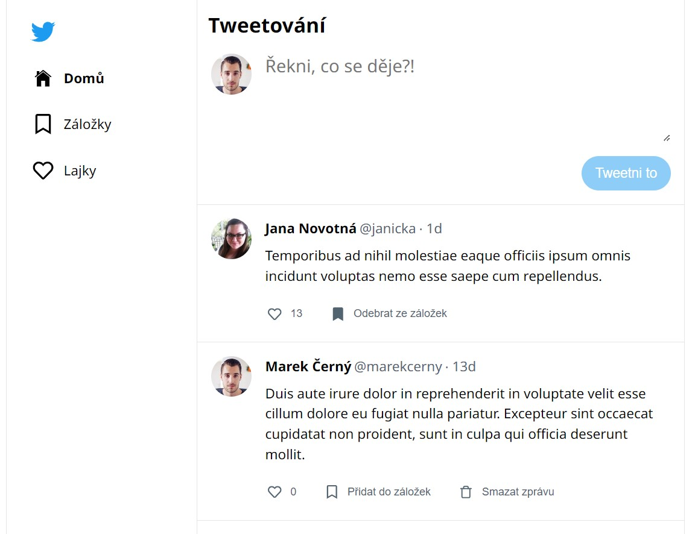

# Projekt Tweetnito

Aplikace pro sdělení krátké zprávy na způsob Twitteru.

**Na tomto projektu aktuálně pracuju.**

>- programuju v **Reactu** s **TypeScriptem**
>- využívám bundler **Vite**
>- data ukládám do **sesionStorage**

## Zadání
Vytvořit jednoduchou aplikaci napodobující Twitter. Základní funkcí bude, aby uživatel mohl zadat krátký text do textového políčka, který se následně objeví v seznamu zveřejněných zpráv. Jakmile tuto funkcionalitu dokončíte, rozšiřte aplikaci o další funkce dle vlastních nápadů.

K dispozici je hotový statický HTML a CSS návrh [zde](https://github.com/Czechitas-podklady-WEB/cvrlikani-zadani).

## Abstrakt
Programuju aplikaci s dynamickým obsahem rozdělenou do několika komponent.  
Využila jsem připravený [návrh](https://github.com/Czechitas-podklady-WEB/cvrlikani-zadani), který si upravuju svým potřebám.

### Aktuálně aplikace umožňuje:
- na stránce **Domů** zobrazuje výchozí zprávy uživatelů seřazeny chronologicky od nejnovějšího
- náhodně vygenerovaný profil uživatele, pod kterým lze:
  - **přidat** nový příspěvek
  - **mazat** vlastní příspěvek
  - **přidávat/odebírat** příspěvky ze záložky
  - **lajkovat** příspěvky
- na stránce **Záložky** zobrazuje uložené příspěvky - seřazeny chronologicky podle času přidání do záložky od nejnovějšího
- na stránce **Lajky** zobrazuje nejvíce oblíbené příspěvky - seřazeny chronologicky podle času lajknutí od nejnovějšího

Na dalších funcionalitách aplikace pracuju.

